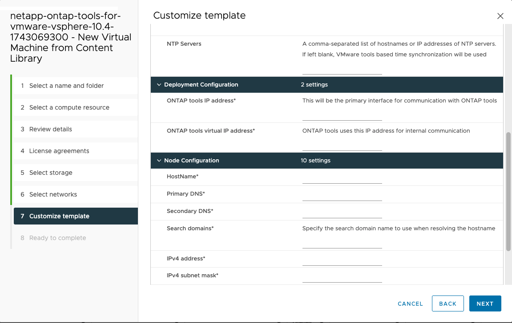

= Bereitstellen von ONTAP tools for VMware vSphere
:allow-uri-read: 
:icons: font
:imagesdir: ../media/

[role="lead"]
Die ONTAP tools for VMware vSphere werden als kleiner Einzelknoten mit Kerndiensten zur Unterstützung von NFS- und VMFS-Datenspeichern bereitgestellt. Die Bereitstellung der ONTAP Tools kann bis zu 45 Minuten dauern.

.Bevor Sie beginnen
Eine Inhaltsbibliothek in VMware ist ein Containerobjekt, das VM-Vorlagen, vApp-Vorlagen und andere Dateitypen speichert. Die Bereitstellung mit Inhaltsbibliothek bietet Ihnen ein nahtloses Erlebnis, da sie nicht von der Netzwerkkonnektivität abhängig ist.

NOTE: Sie sollten die Inhaltsbibliothek auf einem gemeinsam genutzten Datenspeicher speichern, damit alle Hosts innerhalb eines Clusters darauf zugreifen können.  Erstellen Sie eine Inhaltsbibliothek zum Speichern der OVA, bevor Sie das Gerät auf HA-Konfiguration konfigurieren.  Löschen Sie die Inhaltsbibliotheksvorlage nach der Bereitstellung nicht.

NOTE: Um die HA-Bereitstellung später zu aktivieren, stellen Sie die virtuelle Maschine, auf der die ONTAP Tools gehostet werden, nicht direkt auf einem ESXi-Host bereit.  Stellen Sie es stattdessen auf einem Cluster oder Ressourcenpool bereit.

Wenn Sie keine Inhaltsbibliothek haben, führen Sie die folgenden Schritte aus, um eine zu erstellen:

*Inhaltsbibliothek erstellen* Wenn Sie nur eine kleine Bereitstellung mit einem einzelnen Knoten verwenden möchten, ist das Erstellen einer Inhaltsbibliothek nicht erforderlich.

. Laden Sie die Datei mit den Binärdateien (_.ova_) und signierten Zertifikaten für ONTAP tools for VMware vSphere von der  https://mysupport.netapp.com/site/products/all/details/otv10/downloads-tab["NetApp Support Site"^] .
. Melden Sie sich beim vSphere-Client an
. Wählen Sie das vSphere-Clientmenü und wählen Sie *Inhaltsbibliotheken*.
. Wählen Sie rechts auf der Seite *Erstellen* aus.
. Geben Sie der Bibliothek einen Namen und erstellen Sie die Inhaltsbibliothek.
. Navigieren Sie zu der von Ihnen erstellten Inhaltsbibliothek.
. Wählen Sie rechts auf der Seite *Aktionen* und wählen Sie *Element importieren* und importieren Sie die OVA-Datei.

NOTE: Weitere Informationen finden Sie unter https://blogs.vmware.com/vsphere/2020/01/creating-and-using-content-library.html["Erstellen und Verwenden der Inhaltsbibliothek"] Blog.

NOTE: Bevor Sie mit der Bereitstellung fortfahren, stellen Sie den Distributed Resource Scheduler (DRS) des Clusters im Inventar auf „Konservativ“ ein. Dadurch wird sichergestellt, dass während der Installation keine VMs migriert werden.

Die ONTAP tools for VMware vSphere werden zunächst als Nicht-HA-Setup bereitgestellt. Um auf die HA-Bereitstellung zu skalieren, müssen Sie das CPU-Hot-Plug-in und das Memory-Hot-Plug-in aktivieren.  Sie können diesen Schritt als Teil des Bereitstellungsprozesses ausführen oder die VM-Einstellungen nach der Bereitstellung bearbeiten.

.Schritte
. Laden Sie die Datei herunter, die die Binärdateien (_.ova_) und signierten Zertifikate für die ONTAP tools for VMware vSphere enthält https://mysupport.netapp.com/site/products/all/details/otv10/downloads-tab["NetApp Support Site"^]. Wenn Sie die OVA in die Inhaltsbibliothek importiert haben, können Sie diesen Schritt überspringen und mit dem nächsten Schritt fortfahren
. Melden Sie sich beim vSphere-Server an.
. Navigieren Sie zum Ressourcenpool, Cluster oder Host, auf dem Sie die OVA bereitstellen möchten.
+

NOTE: Speichern Sie ONTAP tools for VMware vSphere Maschinen niemals auf den von ihnen verwalteten vVols -Datenspeichern.

. Sie können die OVA aus der Inhaltsbibliothek oder vom lokalen System bereitstellen.
+
|===

| Vom lokalen System | Aus der Inhaltsbibliothek 

| a. Klicken Sie mit der rechten Maustaste und wählen Sie *OVF-Vorlage bereitstellen…*. b. Wählen Sie die OVA-Datei aus der URL aus oder navigieren Sie zu ihrem Speicherort und wählen Sie dann *Weiter*. | a. Gehen Sie zu Ihrer Inhaltsbibliothek und wählen Sie das Bibliothekselement aus, das Sie bereitstellen möchten. b. Wählen Sie *Aktionen* > *Neue VM aus dieser Vorlage* 
|===
. Geben Sie im Feld *Namen und Ordner auswählen* den Namen der virtuellen Maschine ein und wählen Sie ihren Speicherort aus.
+
** Wenn Sie die Version 8.0.3 von vCenter Server verwenden, wählen Sie die Option *Hardware dieser virtuellen Maschine anpassen*. Dadurch wird ein zusätzlicher Schritt namens *Hardware anpassen* aktiviert, bevor Sie mit dem Fenster *Bereit zum Abschließen* fortfahren.
** Wenn Sie die Version 7.0.3 von vCenter Server verwenden, befolgen Sie die Schritte im Abschnitt *Was kommt als Nächstes?* am Ende der Bereitstellung.image:../media/select-name.png["Wählen Sie einen Namen und einen Ordner"]

. Wählen Sie eine Computerressource aus und klicken Sie auf *Weiter*.  Aktivieren Sie optional das Kontrollkästchen „Bereitgestellte VM automatisch einschalten“.
. Überprüfen Sie die Details der Vorlage und wählen Sie *Weiter*.
. Lesen und akzeptieren Sie die Lizenzvereinbarung und wählen Sie *Weiter*.
. Wählen Sie den Speicher für die Konfiguration und das Datenträgerformat aus und wählen Sie *Weiter*.
. Wählen Sie für jedes Quellnetzwerk das Zielnetzwerk aus und wählen Sie *Weiter*.
. Füllen Sie im Fenster *Vorlage anpassen* die erforderlichen Felder aus und wählen Sie *Weiter*.
+
** Die Informationen werden während der Installation validiert. Bei Abweichungen erscheint eine Fehlermeldung auf der Webkonsole und Sie werden aufgefordert, diese zu korrigieren.
** Hostnamen müssen Buchstaben (AZ, az), Ziffern (0-9) und Bindestriche (-) enthalten.  Um Dual Stack zu konfigurieren, geben Sie den Hostnamen an, der der IPv6-Adresse zugeordnet ist.
+

NOTE: Reines IPv6 wird nicht unterstützt.  Der gemischte Modus wird mit VLAN unterstützt, das sowohl IPv6- als auch IPv4-Adressen enthält.

** Die IP-Adresse der ONTAP -Tools ist die primäre Schnittstelle für die Kommunikation mit ONTAP -Tools.
** IPv4 ist die IP-Adresskomponente der Knotenkonfiguration, die verwendet werden kann, um zu Debugging- und Wartungszwecken den Diagnose-Shell- und SSH-Zugriff auf den Knoten zu ermöglichen.

. Wenn Sie die Version 8.0.3 von vCenter Server verwenden, aktivieren Sie im Fenster *Hardware anpassen* die Optionen *CPU Hot Add* und *Memory Hot Plug*, um die HA-Funktionalität zu ermöglichen.image:../media/customize-hw.png["Hardware anpassen"]
. Überprüfen Sie die Details im Fenster *Bereit zum Abschließen* und wählen Sie *Fertig*.
+
Während die Bereitstellungsaufgabe erstellt wird, wird der Fortschritt in der vSphere-Taskleiste angezeigt.

. Schalten Sie die VM nach Abschluss der Aufgabe ein, wenn die Option zum automatischen Einschalten der VM nicht ausgewählt wurde.

Sie können den Fortschritt der Installation in der Webkonsole der VM verfolgen.

Wenn im OVF-Formular Unstimmigkeiten auftreten, werden Sie in einem Dialogfeld aufgefordert, Korrekturmaßnahmen zu ergreifen. Navigieren Sie mit der Tabulatortaste, nehmen Sie die erforderlichen Änderungen vor und wählen Sie *OK*. Sie haben drei Versuche, etwaige Probleme zu lösen. Wenn die Probleme nach drei Versuchen weiterhin bestehen, wird der Installationsvorgang abgebrochen und es wird empfohlen, die Installation auf einer neuen virtuellen Maschine erneut zu versuchen.

.Wie geht es weiter?
Wenn Sie über ONTAP tools for VMware vSphere mit vCenter Server 7.0.3 verfügen, führen Sie nach der Bereitstellung die folgenden Schritte aus.

. Melden Sie sich beim vCenter-Client an
. Fahren Sie den ONTAP Tools-Knoten herunter.
. Navigieren Sie zu den ONTAP tools for VMware vSphere Maschine unter *Inventar* und wählen Sie die Option *Einstellungen bearbeiten*.
. Aktivieren Sie unter den *CPU*-Optionen das Kontrollkästchen *CPU-Hot-Add aktivieren*
. Aktivieren Sie unter den *Speicher*-Optionen das Kontrollkästchen *Aktivieren* neben *Speicher-Hotplug*.

