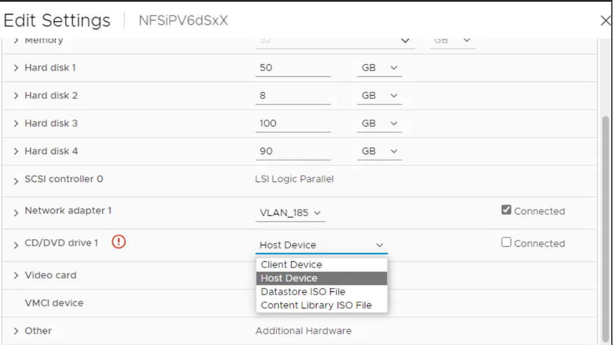

= Upgrade von ONTAP tools for VMware vSphere 10.x auf 10.4
:allow-uri-read: 
:icons: font
:imagesdir: ../media/

[role="lead"]
Sie können von ONTAP tools for VMware vSphere 10.2 oder 10.3 auf 10.4 aktualisieren. Ein direktes Upgrade von ONTAP Tools 10.0 oder 10.1 auf 10.4 wird jedoch nicht unterstützt.

NOTIZ:

* In ASA r2-Systemen sollten Sie auf ONTAP tools for VMware vSphere 10.4 mit ONTAP 9.16.1 aktualisieren, bevor Sie weitere Storage Availability Zones (SAZs) hinzufügen.
* Wenn das Upgrade von ONTAP tools for VMware vSphere 10.2 oder 10.3 auf die Version 10.4 fehlschlägt, wird ein Rollback nicht unterstützt.  Um das Setup wiederherzustellen, verwenden Sie RPO für ONTAP tools for VMware vSphere 10.2 und Near-Zero-RPO oder Snapshot-Wiederherstellung für ONTAP tools for VMware vSphere 10.3.

.Bevor Sie beginnen
Schalten Sie bei einem Nicht-HA-Upgrade die ONTAP -Tools-VM aus und bei einem HA-Upgrade den ONTAP -Tools-Verwaltungsknoten, bevor Sie die folgenden Änderungen an den Einstellungen der virtuellen Maschine (VM) vornehmen.

Wenn Sie von ONTAP tools for VMware vSphere 10.2 oder 10.3 aktualisieren, müssen Sie vor dem Upgrade folgende Schritte ausführen: * Fügen Sie jedem Knoten eine zusätzliche 100-GB-Festplatte hinzu, da die Servicedaten lokal auf der VM gespeichert sind. * Passen Sie CPU und Speicher für die ausgeschaltete VM entsprechend Ihrer Implementierung an. Aktivieren Sie das Hot-Plugin für CPU und RAM.

+

|===
| Bereitstellungstyp | CPU (Kern) pro Knoten | Speicher (GB) pro Knoten | Festplattenspeicher (GB) pro Knoten | CPU gesamt (Kern) | Speicher (GB) | Gesamter Festplattenspeicher (GB) 

| Nicht-HA Klein | 9 | 18 | 350 | 9 | 18 | 350 

| Nicht-HA-Medium | 13 | 26 | 350 | 13 | 26 | 350 

| HA Klein | 9 | 18 | 350 | 27 | 54 | 1050 

| HA Mittel | 13 | 26 | 350 | 39 | 78 | 1050 

| HA Groß | 17 | 34 | 350 | 51 | 102 | 1050 
|===
* Schalten Sie die VM ein, nachdem die Änderungen vorgenommen wurden, und warten Sie, bis die Dienste in den laufenden Zustand versetzt werden.
* Nehmen Sie im Falle einer HA-Bereitstellung die Ressourcenänderungen vor, aktivieren Sie das Hot-Plugin für CPU und RAM und fügen Sie auch für den zweiten und dritten Knoten 100-GB-Festplatten hinzu.  Ein Neustart dieser Knoten ist nicht erforderlich.
* Wenn die Appliance mit ONTAP Tools 10.2 als lokaler Pfad (einfache Bereitstellung) bereitgestellt wurde, müssen Sie vor dem Upgrade einen Quiesce-Snapshot erstellen.

Wenn Sie ein Upgrade von ONTAP tools for VMware vSphere 10.0 auf 10.1 durchführen, müssen Sie die folgenden Schritte ausführen, bevor Sie mit der Upgrade-Aufgabe fortfahren: *Diagnose aktivieren*

. Öffnen Sie vom vCenter Server aus eine Konsole für die ONTAP Tools.
. Melden Sie sich als Wartungsbenutzer an.
. Geben Sie *4* ein, um *Support und Diagnose* auszuwählen.
. Geben Sie *2* ein, um *Remotediagnosezugriff aktivieren* auszuwählen.
. Geben Sie *y* ein, um das Passwort Ihrer Wahl festzulegen.
. Melden Sie sich vom Terminal/Putty aus mit dem Benutzer „diag“ und dem im vorherigen Schritt festgelegten Kennwort bei der VM-IP-Adresse an.

*Erstellen Sie ein Backup von MongoDB*

Führen Sie die folgenden Befehle aus, um eine Sicherung von MongoDB zu erstellen:

* kn exec -it ntv-mongodb-0 sh - kn ist ein Alias von kubectl -n ntv-system.
* Führen Sie den Befehl _env | grep MONGODB_ROOT_PASSWORD_ im Pod aus.
* Führen Sie den Befehl _exit_ aus, um den Pod zu verlassen.
* Führen Sie den Befehl _kn exec ntv-mongodb-0 --mongodump -u root -p MONGODB_ROOT_PASSWORD --archive=/tmp/mongodb-backup.gz --gzip_ aus, um das im obigen Befehl festgelegte MONGO_ROOT_PASSWORD zu ersetzen.
* Führen Sie den Befehl _kn cp ntv-mongodb-0:/tmp/mongodb-backup.gz ./mongodb-backup.gz_ aus, um das mit dem obigen Befehl erstellte MongoDB-Backup vom Pod auf den Host zu kopieren.

*Machen Sie den Quasi-Schnappschuss aller Bände*

* Führen Sie den Befehl „kn get pvc“ aus und speichern Sie die Befehlsausgabe.
* Erstellen Sie mit einer der folgenden Methoden nacheinander Snapshots aller Volumes:
+
** Führen Sie in der CLI den Befehl _volume snapshot create -vserver <vserver_name> -volume <volume_name> -snapshot <snapshot_name>_ aus.
** Suchen Sie in der Benutzeroberfläche des ONTAP System Managers nach dem Volume anhand seines Namens in der Suchleiste und öffnen Sie das Volume dann, indem Sie auf den Namen klicken.  Gehen Sie zum Snapshot und fügen Sie den Snapshot dieses Volumes hinzu.

*Erstellen Sie den Snapshot der ONTAP tools for VMware vSphere VMs in vCenter (3 VMs im Fall einer HA-Bereitstellung, 1 VM im Fall einer Nicht-HA-Bereitstellung)*

* Wählen Sie in der Benutzeroberfläche des vSphere-Clients die VM aus.
* Gehen Sie zur Registerkarte „Schnappschüsse“ und wählen Sie die Schaltfläche „Schnappschuss machen“ aus.  Erstellen Sie einen Ruhe-Snapshot der VM.  Siehe https://techdocs.broadcom.com/us/en/vmware-cis/vsphere/vsphere/8-0/take-snapshots-of-a-virtual-machine.html["Erstellen Sie einen Snapshot einer virtuellen Maschine"^] für Details.

Löschen Sie vor dem Upgrade die abgeschlossenen Pods aus dem Protokollpaket mit dem Präfix „generate-support-bundle-job“.  Wenn die Generierung des Support-Pakets läuft, warten Sie, bis sie abgeschlossen ist, und löschen Sie dann den Pod.

Für jede Art von Upgrade müssen Sie ein zusätzliches 100-GB-Festplattenlaufwerk (HDD) hinzufügen.  Um eine Festplatte hinzuzufügen, führen Sie die folgende Aufgabe aus.

. Wählen Sie die VM in der Einzelknotenkonfiguration oder alle drei VMs in der HA-Konfiguration aus.
. Klicken Sie mit der rechten Maustaste auf die VM(s) und wählen Sie *Neues Gerät hinzufügen* > *Festplatte*
. Fügen Sie im Feld *Neue Festplatte* eine 100-GB-Festplatte hinzu.
. Wählen Sie *Übernehmen*

Aktualisieren Sie nach dem Hinzufügen der Festplatte die Ressourcen der VM für die jeweiligen Konfigurationen und starten Sie die primäre VM neu.

Es wird eine neue Festplatte erstellt.  Der Dynamic Storage Provisioner verwendet diese Festplatte zum Generieren oder Replizieren der Volumes.

.Schritte
. Laden Sie ONTAP tools for VMware vSphere -Upgrade-ISO in die Inhaltsbibliothek hoch.
. Wählen Sie auf der primären VM-Seite *Aktionen* > *Einstellungen bearbeiten*
. Wählen Sie die ISO-Datei der Inhaltsbibliothek im Fenster „Einstellungen bearbeiten“ unter dem Feld „CD/DVD-Laufwerk“ aus.
. Wählen Sie die ISO-Datei aus und klicken Sie auf *OK*.  Aktivieren Sie das Kontrollkästchen neben dem Feld *CD/DVD-Laufwerk*.
. Öffnen Sie vom vCenter Server aus eine Konsole für die ONTAP Tools.
. Melden Sie sich als Wartungsbenutzer an.
. Geben Sie *3* ein, um das Menü „Systemkonfiguration“ auszuwählen.
. Geben Sie *7* ein, um die Upgrade-Option auszuwählen.
. Beim Upgrade werden die folgenden Aktionen automatisch ausgeführt:
+
.. Zertifikatsupgrade
.. Remote-Plugin-Upgrade

Nach dem Upgrade auf ONTAP tools for VMware vSphere 10.4 können Sie:

* Deaktivieren Sie die Dienste über die Manager-Benutzeroberfläche
* Wechseln Sie von einem Nicht-HA-Setup zu einem HA-Setup
* Skalieren Sie eine kleine Konfiguration ohne HA auf eine mittlere Konfiguration ohne HA oder auf eine mittlere oder große Konfiguration mit HA.
* Starten Sie im Falle eines Nicht-HA-Upgrades die ONTAP -Tools-VM neu, um die Änderungen zu übernehmen. Starten Sie im Falle eines HA-Upgrades den Verwaltungsknoten der ONTAP Tools neu, um die Änderungen auf dem Knoten zu übernehmen.

.Was kommt als nächstes
Nachdem Sie von früheren Versionen der ONTAP tools for VMware vSphere auf 10.4 aktualisiert haben, scannen Sie die SRA-Adapter erneut, um zu überprüfen, ob die Details auf der Seite „VMware Live Site Recovery Storage Replication Adapters“ aktualisiert wurden.

Nachdem Sie das Upgrade erfolgreich durchgeführt haben, löschen Sie die Trident -Volumes manuell von ONTAP , indem Sie das folgende Verfahren verwenden:

NOTE: Diese Schritte sind nicht erforderlich, wenn sich die ONTAP tools for VMware vSphere 10.1 oder 10.2 in kleinen oder mittleren (lokalen Pfad-)Konfigurationen ohne HA befanden.

. Öffnen Sie vom vCenter Server aus eine Konsole für die ONTAP Tools.
. Melden Sie sich als Wartungsbenutzer an.
. Geben Sie *4* ein, um das Menü *Support und Diagnose* auszuwählen.
. Geben Sie *1* ein, um die Option *Auf Diagnose-Shell zugreifen* auszuwählen.
. Führen Sie den folgenden Befehl aus
+
[listing]
----
sudo python3 /home/maint/scripts/ontap_cleanup.py
----
. Geben Sie den ONTAP -Benutzernamen und das Kennwort ein

Dadurch werden alle Trident -Volumes in ONTAP gelöscht, die in ONTAP tools for VMware vSphere 10.1/10.2 verwendet werden.

.Ähnliche Informationen
link:../migrate/migrate-to-latest-ontaptools.html["Migrieren Sie von ONTAP tools for VMware vSphere 9.xx auf 10.4"]
